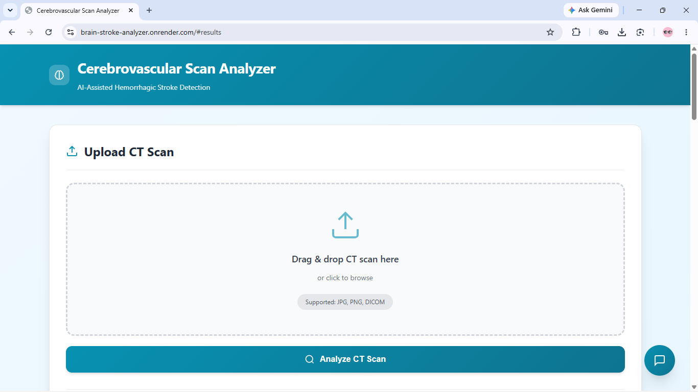
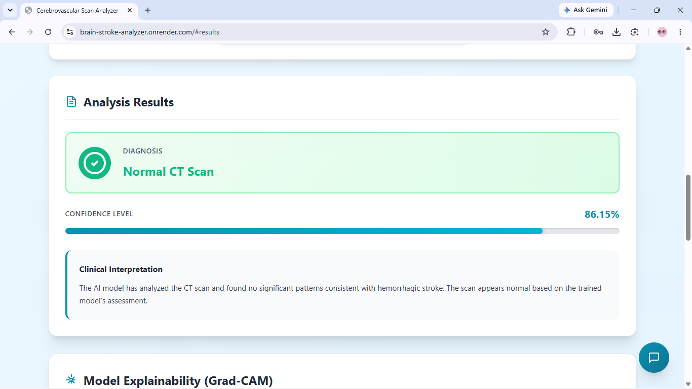
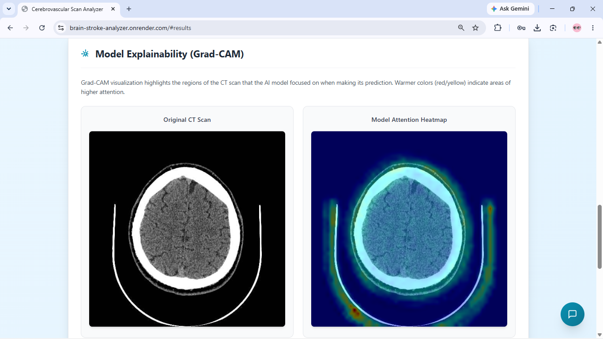
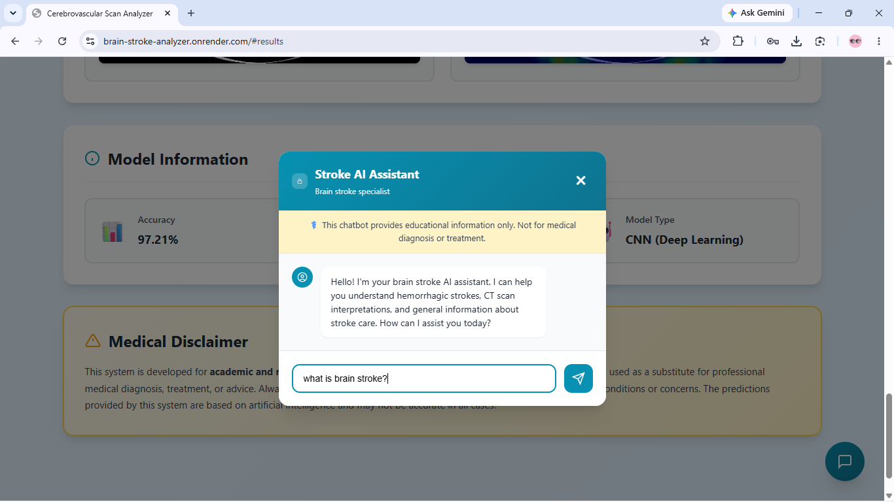

# 🧠 Brain Stroke Detection & Analysis

An AI-powered web application that analyzes Brain CT scans to detect hemorrhagic strokes. The application not only provides a prediction but also generates **Grad-CAM heatmaps** for visual explainability. Additionally, it features an integrated medical AI chatbot to help answer general educational questions about brain strokes.

## ✨ Features
- **Stroke Detection**: Upload a CT scan image to predict whether it indicates a hemorrhagic stroke or is normal.
- **Explainable AI (Saliency Map)**: Generates a color-coded heatmap over the CT scan to highlight the regions that most influenced the model's prediction, aiding in transparency.
- **Interactive Medical Chatbot**: Ask questions about stroke symptoms, features, and educational medical info using an integrated Llama-3-powered chatbot (via Groq API).
- **Responsive UI**: A clean, modern web interface.

## 📸 Screenshots

### 1. Clean Upload Interface


### 2. Stroke Analysis & Confidence Score


### 3. Model Explainability (Saliency Map Heatmap)


### 4. Interactive Medical AI Chatbot


## 🛠️ Tech Stack
- **Backend**: Python, Flask, Gunicorn
- **AI/ML Engine**: TensorFlow Lite (Optimized for ultra-low memory environments), OpenCV, NumPy
- **LLM API**: Groq API (Llama-3.3-70b-versatile)
- **Frontend**: HTML5, CSS3, JavaScript
- **Deployment**: Pre-configured for deployment on free-tier platforms like Render (`requirements.txt`, `runtime.txt`).

## 🚀 Local Setup

1. **Clone the repository**:
   ```bash
   git clone https://github.com/sivaramaraju2124/Brain-Stroke-Detection.git
   cd Brain-Stroke-Detection
   ```

2. **Create a virtual environment (Optional but recommended)**:
   ```bash
   python -m venv venv
   # On Windows use: venv\Scripts\activate
   # On Mac/Linux use: source venv/bin/activate
   ```

3. **Install dependencies**:
   ```bash
   pip install -r requirements.txt
   ```

4. **Set up environment variables**:
   Create a `.env` file in the root directory and add your Groq API key:
   ```env
   GROQ_API_KEY=your_api_key_here
   ```

5. **Run the application**:
   ```bash
   python app.py
   ```
   Open `http://127.0.0.1:5000` in your web browser.

## 🧠 How it Works
1. **Preprocessing**: The uploaded image is resized to 224x224, normalized, and converted to an RGB array.
2. **Prediction**: The image is passed through a custom trained dual-output CNN model (`phase2_kesava.tflite`) via the lightweight TFLite runtime to output a probability score.
3. **Attention Heatmap**: The raw feature maps of the deepest convolutional layer are extracted to generate a Saliency Map overlay, providing explainability by highlighting the areas of the brain the model focused on.

## ⚠️ Disclaimer
**This tool is for educational and research purposes only.** It is not a substitute for professional medical advice, diagnosis, or treatment. Always seek the advice of your physician or other qualified health provider with any questions you may have regarding a medical condition.
